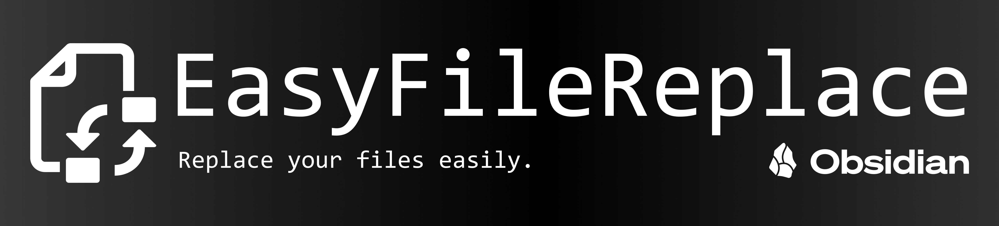

# My main projects

<table align="center">
  <tr>
    <td align="center" width="50%">
      
        
      <em>An Obsidian plugin to turn your soundtrack into a worldbuilding tool.</em>
        
      <a href="https://github.com/SrPernax/obsidian-storyscore">Visit repository →</a>
    </td>
    <td align="center" width="50%">
      
        
      <em>An Obsidian plugin to effortlessly replace your attachments' contents without breaking links.</em>
        
      <a href="https://github.com/SrPernax/obsidian-easyfilereplace">Visit repository →</a>
    </td>
  </tr>
</table>
